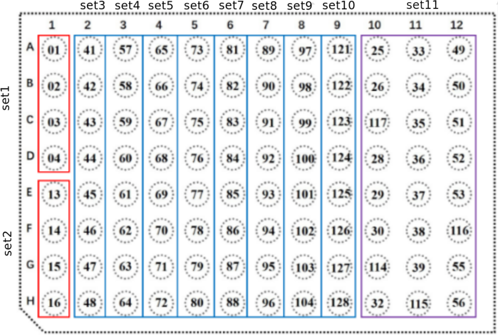

# MergeGI

**MergeGI** provides a single command line to merge and select barcoded raw data from [MGI](https://en.mgi-tech.com/products/) sequencing runs into a set of FastQ files ready for subsequent bioinformatics analysis. 


- [Installation](#installation)
- [Getting Started](#getting-started)
- [General Usage](#general-usage)


## Installation

We provide **MergeGI** as a Python library available on [Pypi](https://pypi.python.org). The standalone application is called **mergegi** and can be installed in an environment with Python>3.6 as follows:

    pip install mergegi

There is no dependencies except for **click** package so that installation should be straightforward. 

## Overview

The main goal of **MergeGI** is to select and merge the FastQ files generated by a MGI sequencer into a list of FastQ files directly usable for subsequent bioinformatics analysis. Why do we need to do this preprocessing ? 

First, MGI generates one FastQ file per barcode. You may not need all those barcodes yet the demultiplexing performs a systematic search of all barcodes. Consequently, you will end up with FastQ files corresponding to your barcode and a bunch of FastQ files  that should be ignored. Given the information from your wetlab colleagues you should have the list of samples and their relevant barcodes. 

Second, MGI technologies imposes that barcodes being processed in a specific manner meaning that a given sample may be split into several barcodse (files). Therefore we need a tool to merge such files. Again, the wetlab should provide the barcodes corresponding to a given sample. See image below for more explanation

Third, a MGI flowcell has several lanes. You may want to merge the lanes or not. 

Those 3 steps should be managed seemlessly by our tool given a sample sheet and the output directory of the MGI runs.

## General Usage and Examples


The data structure expected by **MergeGI** is the expected output directoy of MGI runs:

    OutputFq/Flowcell/L01
    OutputFq/Flowcell/L02

Where L01/L02 stands for lane 1 and 2.

The software needs a sample sheet that describe the sample name, the associated barcode identifier, the potentially second barcode (if none, the column must still be present with empty strings), the project name (it will be used to create the new output directory), and the lane where is the sample/barcode pair. Here is an example:

```csv
samplename,barcode,barcode2,project,lane
A,         1,,              projectA, 1
B,         2,,              projectA, 1
A,         1,,              projectA, 2
C,         2,,              projectB, 2
C,         3,,              projectB, 1
B,         3,,              projectA, 2
```

> **_IMPORTANT NOTE1:_**  the current version uses the barcode 1 only (column barcode). 

> **_IMPORTANT NOTE2:_**  The header must be present. The header names are not important but columns must be sorted with the expected order: sample name, barcode 1, barcode 2, projetc name, lane. 


Given the sample sheet, and the input directory (top level of the MGI runs), this command should create a new clean directory with the relevant FastQ files (here in merge_data directory):

```bash
mergegi --samplesheet samplesheet.csv --input-directory mgi_raw_data --output-directory merge_data 
```

If the data is paired, add *--paired* argument

```bash
mergegi --samplesheet samplesheet.csv --input-directory mgi_raw_data --output-directory merge_data --paired
```


By default, lanes are merged. If this is not what you want you may disable this option:

```bash
mergegi --samplesheet samplesheet.csv --input-directory mgi_raw_data --output-directory merge_data --paired --no-merge
```

## Barcode distribution example




